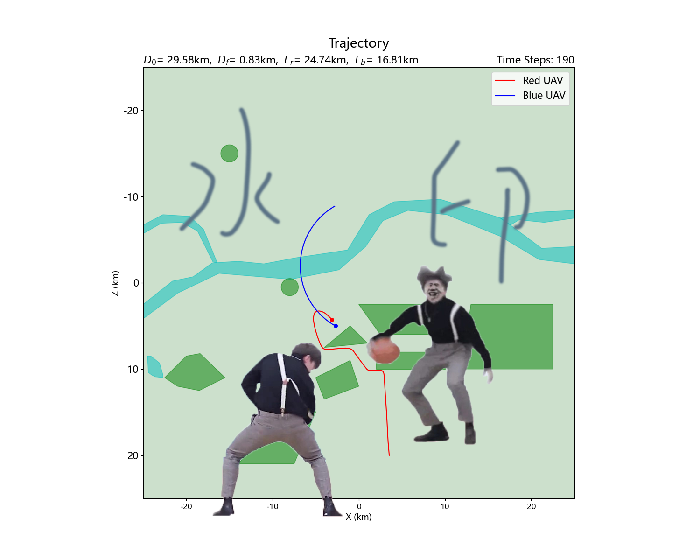

# 深度强化学习路径规划

# DRL-for-Path-Planning

## 算法:

SAC-1812 # 不是1801

Soft Actor-Critic Algorithms and Applications （arXiv: 1812)

## 效果:

### 1.静态路径规划（几何）

直接找几个点组成路径，学习组成路径的点

### **2.动态路径规划（运动学）**

雷达避障模型

运动学仿真，学习控制量

（先放张效果图，写完论文过完年再更）

## **Requirement**:

python >= 3.9

pytorch >= 1.10.2 （深度学习）

gym >= 0.21.0 （环境API）

numpy >= 1.22.3 （矩阵）

matplotlib >= 3.5.1 （绘图）

scipy >=  1.7.3 （积分）

shapely >= 2.0.1 （障碍）

###### 广告：

[Path-Planning: 路径规划算法，A*、Dijstra、Hybrid A*等经典路径规划](https://github.com/zhaohaojie1998/A-Star-for-Path-Planning)

[Grey-Wolf-Optimizer-for-Path-Planning: 灰狼优化算法路径规划、多智能体/多无人机航迹规划](https://github.com/zhaohaojie1998/Grey-Wolf-Optimizer-for-Path-Planning)

