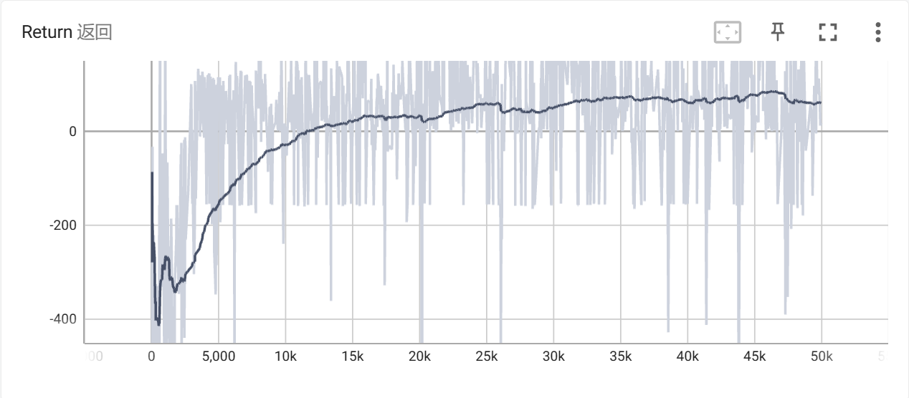
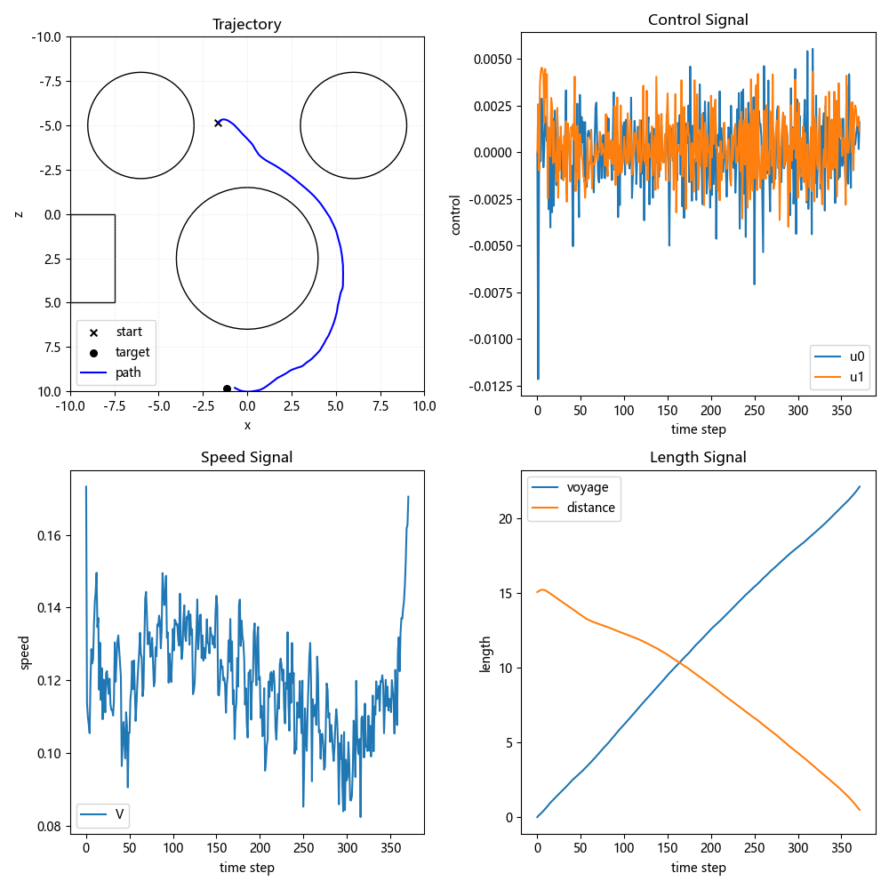
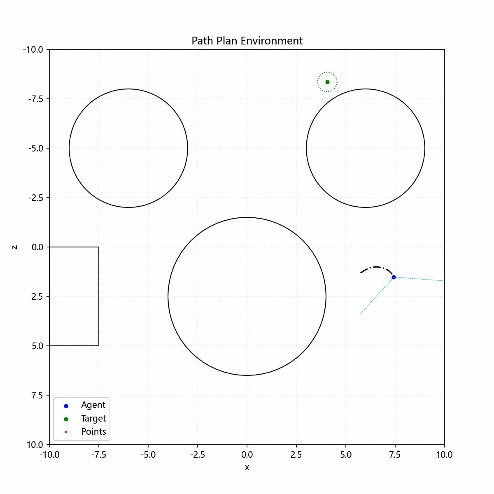

# PyTorch版SAC-Auto强化学习算法与应用示例

## 零.SAC-Auto算法:

###### 自定义程度高的SAC-Auto算法，支持部署策略模型、备份训练过程、多源观测融合、PER等功能

论文：《Soft Actor-Critic Algorithms and Applications （arXiv: 1812) 》# 不是1801版

| 算法构成     | 说明                 |
| ------------ | -------------------- |
| rl_typing.py | 强化学习数据类型声明 |
| sac_agent.py | SAC-Auto算法         |

### (0).SAC_Agent模块

###### SAC-Auto算法主模块

##### 0.初始化接口

```python
agent = SAC_Agent(env, kwargs=...)      # 初始化算法, 并设置SAC的训练参数
agent.set_buffer(buffer)                # 为算法自定义replay buffer
agent.set_nn(actor, critic, kwargs=...) # 为算法自定义神经网络
# 更多具体接口信息通过help函数查看DocString
```

##### 1.Torch接口

```python
agent.to('cpu') # 将算法转移到指定设备上
agent.cuda(0)   # 将算法转移到cuda0上运算
agent.cpu()     # 将算法转移到cpu上运算
```

##### 2.IO接口

```python
agent.save('./训练备份')              # 存储算法训练过程checkpoint
agent.load('./训练备份')              # 加载算法训练过程checkpoint
agent.export('策略.onnx', kwargs=...) # 部署训练好的onnx策略模型
```

##### 3.训练交互接口

```python
act_array = agent.select_action(obs, kwargs=...) # 环境交互, 基于策略选择-1~1的随机/确定动作
act_array = agent.random_action()                # 环境随机探索, 完全随机产生-1~1的动作
agent.store_memory(transition, kwargs=...)       # 存储环境转移元组(s, a, r, s_, done)
info_dict = agent.learn(kwargs=...)              # 进行一次SAC优化, 返回Loss/Q函数/...
```

##### 4.其余接口/属性 (非用户调用接口，可在派生SAC_Agent模块中覆写)

```python
obs_tensor = agent.state_to_tensor(obs, kwargs=...) # 将Gym返回的1个obs转换成batch_obs, 用于处理混合输入情况, 默认跟随buffer设置
batch_dict = agent.replay_memory(batch_size, kwargs=...) # 经验回放, 用于实现花样经验回放, 默认跟随buffer设置
agent.buffer_len # 算法属性, 查看当前经验个数, 默认跟随buffer设置
agent.use_per # 算法属性, 查看是否使用PER, 默认跟随buffer设置
```

### (1).SAC_Actor模块和SAC_Critic模块

###### 实现自定义 **观测Encoder** + **策略函数** + **Q函数**

##### 0.自定义神经网络要求

- 要求 **观测Encoder** 输入为观测 *batch_obs* 张量，输出形状为(batch, feature_dim)的特征 *batch_feature* 张量。要求forward函数只接受一个位置参数obs，混合观测要求传入的obs为张量字典dict[any, Tensor] / 张量列表list[Tensor] / 张量元组tuple[Tensor, ...]。
- 要求 **策略函数** 输入为特征 *batch_feature* 张量，输出形状为(batch, action_dim)的未经tanh激活的均值 *batch_mu* 张量和对数标准差 *batch_logstd* 张量。要求forward函数只接受一个位置参数feature，形状为(batch, feature_dim)。
- 要求 **Q函数** 输入为特征 *batch_feature* 张量+动作 *batch_action* 张量，输出形状为(batch, 1)的Q值 *batch_q* 张量。要求forward函数只接受一个位置参数 *feature_and_action*，形状为(batch, feature_dim+action_dim)。

##### 1.自定义神经网络示例

```python
FEATURE_DIM = 128
ACTION_DIM = 3

# 自定义观测Encoder
class MyEncoder(nn.Module):
    def __init__(self):
        super().__init__()
        self.encoder = ... # user encoder: CNN、RNN、Transformer、GNN ... 
        self.mlp = nn.Sequential(
            nn.Linear(..., FEATURE_DIM),
            nn.ReLU(True),
        )
    def forward(self, observation):
        feature = self.mlp(self.encoder(observation))
        return feature

encoder_net = MyEncoder()

# 自定义策略函数
class MyPolicy(nn.Module):
    def __init__(self):
        super().__init__()
	self.mlp = nn.Sequential(
            nn.Linear(FEATURE_DIM, 128),
            nn.ReLU(True),
	    nn.Linear(128, ACTION_DIM), # no activation
        )
    def forward(self, feature):
        return self.mlp(feature)

mu_net, logstd_net = MyPolicy(), MyPolicy()

# 自定义TwinQ函数
class MyQfun(nn.Module):
    def __init__(self):
        super().__init__()
	self.mlp = nn.Sequential(
            nn.Linear(FEATURE_DIM + ACTION_DIM, 128),
            nn.ReLU(True),
	    nn.Linear(128, 1), # no activation
        )
    def forward(self, feature_and_action):
        return self.mlp(feature_and_action)

q1_net, q2_net = MyQfun(), MyQfun()

# 为算法设置神经网络
actor = SAC_Actor(encoder_net, mu_net, logstd_net, kwargs=...) # 实例化actor网络
critic = SAC_Critic(encoder_net, q1_net, q2_net)               # 实例化critic网络

agent.set_nn(
    actor, 
    critic, 
    actor_optim_cls = th.optim.Adam, 
    critic_optim_cls = th.optim.Adam, 
    copy = True
)
```

### (2).BaseBuffer模块

##### 0.自定义Buffer要求

实现自定义经验回放，可自定义存储不同数据类型的混合观测数据（进行一些多传感器数据融合的端到端控制问题求解），也可自定义实现PER等功能。

要求在派生类中实现以下抽象方法（输入参数和返回数据的格式参考DocString)，可参考demo_train.py中派生类实现方法：

|    **必须实现的方法**    | **功能**                                                                                                                                                                                                                                           |
| :-----------------------------: | :------------------------------------------------------------------------------------------------------------------------------------------------------------------------------------------------------------------------------------------------------- |
|              reset              | 重置经验池（Off-Policy算法一般用不到），也可用于初始化经验池（生成转移元组collections）                                                                                                                                                                  |
|              push              | 经验存储：存入环境转移元组*(s, a, r, s_, done)* ，其中状态*s* 和下一个状态 *s_* （或观测 *obs* ）为array（或混合形式dict[any, array]、list[array]、tuple[array, ...]），动作 *a* 为array，奖励 *r* 为float， *s_* 是否存在 *done* 为bool。 |
|             sample             | 经验采样：要求返回包含关键字*'s','a','r','s_','done'* 的*batch* 字典， *batch* 的每个key对应value为Tensor（或dict[any, Tensor]、list[Tensor]、tuple[Tensor, ...]）；PER的batch还要包含关键字 *'IS_weight'* ，对应的value为Tensor。                 |
|         state_to_tensor         | 数据升维并转换：将Gym输出的1个*obs* 转换成 *batch obs* ，要求返回Tensor（或混合形式dict[any, Tensor]、list[Tensor]、tuple[Tensor, ...]）。                                                                                                           |
| **非必须实现的方法/属性** | **功能**                                                                                                                                                                                                                                           |
|              save              | 存储buffer数据，用于保存训练进度，可省略                                                                                                                                                                                                                 |
|              load              | 加载buffer数据，用于加载训练进度，可省略                                                                                                                                                                                                                 |
|        update_priorities        | 用于更新PER的优先级，非PER可省略                                                                                                                                                                                                                         |
|         is_per（属性）         | 是否是PER回放，默认False                                                                                                                                                                                                                                 |
|         is_rnn（属性）         | 是否RNN按episode回放，默认False                                                                                                                                                                                                                          |
|         nbytes（属性）         | 用于查看经验池占用内存，默认0                                                                                                                                                                                                                            |

##### 1.自定义Buffer示例

```python
MAX_SIZE = int(2**20)
OBS_SPACE = env.observation_space
ACT_SPACE = env.action_space

# 自定义Buffer
class Buffer(BaseBuffer):
    def __init__(self, max_size: int, obs_space: Space, act_space: Union[Box, Discrete]):
        super().__init__()
        # 控制参数
	self.max_size = max_size
        self.curr_size = 0
        self.ptr = 0
        # 数据存储模块
        self.obs_space = obs_space
        self.act_space = act_space
        self.data = ... # user collection
  
    def reset(self, *args, **kwargs):
        self.curr_size = 0
        self.ptr = 0

    def push(
        self, 
        transition: tuple[Obs, Act, float, Obs, bool], 
        terminal: bool = None, 
        **kwargs
    ):
	# add transtion
        self.data[self.ptr] = ... 
	# update
        self.ptr = (1 + self.ptr) % self.max_size
        self.curr_size = min(1 + self.curr_size, self.max_size)

    def sample(
        self, 
        batch_size: int = 1, 
        *,
        idxs: ListLike = None,
        rate: float = None,
        **kwargs,
    ) -> dict[str, Union[ObsBatch, ActBatch, th.FloatTensor]]:
        # sample indexes
	idxs = idxs or np.random.choice(self.curr_size, size=batch_size, replace=False)
	# get data
	batch = {
	    "s": self.data[idxs] # device: self.device; shape: (batch_size, ...); type: FloatTensor / tuple[FloatTensor, ...] / list[FloatTensor] / dict[any, FloatTensor]
            "a": ...             # device: self.device; shape: (batch_size, act_dim(TD3/SAC/PPO) / 1(DQN/DSAC/DPPO)); type: FloatTensor(TD3/SAC/PPO) / LongTensor(DQN/DSAC/DPPO)
            "r": ...             # device: self.device; shape: (batch_size, 1); type: FloatTensor
            "s_": ...            # device: self.device; shape: (batch_size, ...); type: FloatTensor / tuple[FloatTensor, ...] / list[FloatTensor] / dict[any, FloatTensor]
            "done": ...          # device: self.device; shape: (batch_size, 1); type: FloatTensor
	}
        return batch

    def state_to_tensor(self, state: Obs, use_rnn=False) -> ObsBatch:
	# Easy Obs
        return th.FloatTensor(state).unsqueeze(0).to(self.device) # no_rnn: shape = (1, ...); use_rnn: shape = (1, 1, ...) 
        # Mixed Obs
        return {k: th.FloatTensor(state[k]).unsqueeze(0).to(self.device) for k in state.keys()}
        return [th.FloatTensor(state[i]).unsqueeze(0).to(self.device) for i in range(len(state))]
        return tuple(th.FloatTensor(state[i]).unsqueeze(0).to(self.device) for i in range(len(state)))

# 为算法设置Buffer
buffer = Buffer(MAX_SIZE, OBS_SPACE, ACT_SPACE) # 实例化buffer模块
agent.set_buffer(buffer)
```

## 一.路径规划环境SAC应用示例:

###### 路径规划环境包 path_plan_env

| 包含的模块               | 说明                                                 |
| ------------------------ | ---------------------------------------------------- |
| LidarModel               | 激光雷达模拟（基于东北天坐标系）                     |
| NormalizedActionsWrapper | 环境装饰器：非-1~1动作空间归一化，用于与算法适配     |
| DynamicPathPlanning      | 动力学路径规划环境（动作空间-1~1，基于东天南坐标系） |
| StaticPathPlanning       | 路径搜索环境（动作空间非-1~1）                       |

### (0).环境接口

###### gym标准接口格式，初始化时可指定使用老版gym接口风格或新版gym接口风格

```python
# 实例化环境
from path_plan_env import DynamicPathPlanning
env = DynamicPathPlanning(kwargs=...)
# 训练/测试交互
obs, info = env.reset(kwargs=...) # new gym style
obs = env.reset(kwargs=...)       # old gym style
while 1:
    try:
        env.render(kwargs=...) # 可视化路径规划(测试)
        act = np.array([...]) # shape=(act_dim, ) range∈-1~1
        obs, rew, done, truncated, info = env.step(act, kwargs=...) # new gym style
        obs, rew, done, info = env.step(act, kwargs=...)            # old gym style
    except AssertionError:
        env.plot("fig.png", kwargs=...) # 输出规划结果(训练)
        break
```

### (1).路径搜索环境（StaticPathPlanning）

###### 几何层面规划，直接找n个点组成路径，学习组成路径的点

##### 0.转移模型

$$
\mathbf{s}_{new} \gets \mathbf{s}_{old} + \mathbf{a}
$$

##### 1.观测空间&动作空间

1.0观测空间（BoxSpace）:

$$
\mathbf{s} = \mathbf{o} \subset \text{Box} \left \{ x_{0},y_{0},\dots x_{n-1},y_{n-1}  \right \}
$$

| 观测空间             | n=6                             |
| :------------------- | :------------------------------ |
| 空间名（onnx输入名） | ”observation“                 |
| 空间类型             | Box                             |
| 数据结构             | shape = (2n, ); dtype = float32 |
| low                  | [x_min, y_min] * n              |
| high                 | [x_max, y_max] * n              |

1.1动作空间（BoxSpace）:

$$
\mathbf{a} \subset \text{Box} \left \{ dx_{0},dy_{0},\dots dx_{n-1},dy_{n-1}  \right \}
$$

| 动作空间             | n=6                                        |
| :------------------- | :----------------------------------------- |
| 空间名（onnx输出名） | ”action“                                 |
| 空间类型             | Box                                        |
| 数据结构             | shape = (2n, ); dtype = float32            |
| low                  | [-(x_max-x_min)/10, -(y_max-y_min)/10] * n |
| high                 | [+(x_max-x_min)/10, +(y_max-y_min)/10] * n |

##### 2.仿真结果


### (2).动力学路径规划环境（DynamicPathPlanning）

###### 动力学层面规划，学习控制量

##### 0.雷达感知模型


发射n条射线，雷达测距数据结构：

$$
\mathbf{points} = \left [ d_0,d_1,\dots ,d_{n-1} \right ]
$$

$$
\begin{cases}
 d_{i}\in \left [ 0,d_{max} \right ]  & \text{ if } d_{i,real}\le d_{max} \\
 d_{i}=-1 & \text{ if } d_{i,real}> d_{max}
\end{cases}
$$

##### 1.转移模型（东天南坐标系）

动力学模型：

$$
\left\{\begin{array}{l}
\frac{d x}{d t}=V \cos \theta \cos \psi \\
\frac{d y}{d t}=V \sin \theta \equiv 0\\
\frac{d z}{d t}=-V \cos \theta \sin \psi \\
\frac{d V}{d t}=g\left(n_{x}-\sin \theta\right) \\
\frac{d \theta}{d t}=\frac{g}{V}\left(n_{y} \cos \mu-\cos \theta\right)\equiv 0 \\
\frac{d \psi}{d t}=-\frac{g n_{y} \sin \mu}{V \cos \theta}
\end{array}\right.
$$

状态空间（BoxSpace）：

$$
\mathbf{s} \subset \text{Box} \left \{  x,z,V,\psi \right \}
$$

$$
V \in \left [ 0.05,0.2 \right ]
$$

控制空间（BoxSpace）：

$$
\mathbf{u} \subset \text{Box} \left \{ n_{x},\mu  \right \}
$$

$$
n_{x}\in \left [ -0.02,0.02 \right ]
$$

$$
\mu \in \left [ -0.005,0.005 \right ]
$$

##### 2.观测空间&动作空间

2.0观测空间（DictSpace）：

$$
\mathbf{o} \subset \text{Dict}\left \{ \mathbf{vector} _{t-N+1:t}:\text{Box}\left \{ D,V,q \right \}, \mathbf{points}_{t-N+1:t}:\text{Box}\left \{ d_0,d_1,\dots ,d_{n-1} \right \}  \right \}
$$

D为距离、V为速度、q为视线角、points为雷达测距

| 时序vector观测空间           | N=4                                  |
| :--------------------------- | :----------------------------------- |
| 空间名（onnx输入名）         | ”seq_vector"                        |
| 空间类型                     | Box                                  |
| 数据结构                     | shape = (N, 3); dtype = float32      |
| low                          | [ [0, V_low, -pi] ] * N              |
| high                         | [ [1.414*map_size, V_high, pi] ] * N |
| **时序points观测空间** | **N=4，n=128**                       |
| 空间名（onnx输入名）         | “seq_points"                        |
| 空间类型                     | Box                                  |
| 数据结构                     | shape = (N, n) ; dtype = float32     |
| low                          | [ [-1] * n ] * N                     |
| high                         | [ [d_max] * n ] * N                  |

2.1动作空间（BoxSpace）：

$$
\mathbf{a} \subset \text{Box} \left \{ a_0,a_1 \right \}
$$

| 动作空间             |                                |
| :------------------- | ------------------------------ |
| 空间名（onnx输出名） | "action"                       |
| 空间类型             | Box                            |
| 数据结构             | shape = (2, ); dtype = float32 |
| low                  | [-1, -1]                       |
| high                 | [1, 1]                         |

##### 3.训练结果





##### 4.仿真结果



## 二.**Requirement**:

python >= 3.9

SAC算法依赖项：

gym >= 0.21.0 （数据结构API）

numpy >= 1.22.3 （数组运算API）

pytorch >= 1.10.2 （深度学习API）

onnx >= 1.13.1 （模型部署API）

onnxruntime >= 1.15.1 （模型推理API）

非SAC算法依赖项：

tensorboard （训练日志记录）

scipy >= 1.7.3 （自定义Env数值积分）

shapely >= 2.0.1 （自定义Env障碍表示）

matplotlib >= 3.5.1 （自定义Env可视化）

###### 广告：

[Path-Planning: 路径规划算法，A*、Dijstra、Hybrid A*等经典路径规划](https://github.com/zhaohaojie1998/A-Star-for-Path-Planning)


[Grey-Wolf-Optimizer-for-Path-Planning: 灰狼优化算法路径规划、多智能体/多无人机航迹规划](https://github.com/zhaohaojie1998/Grey-Wolf-Optimizer-for-Path-Planning)


