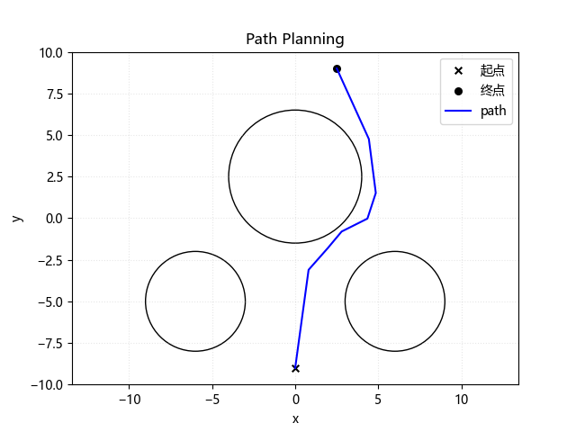

# 深度强化学习路径规划

# DRL-for-Path-Planning

## 算法:

SAC-1812 # 不是1801

Soft Actor-Critic Algorithms and Applications （arXiv: 1812)

## 效果:

## **Requirement**:

python == 3.9 # pytorch2.0暂时支持到3.9

pytorch >= 1.10.2

gym >= 0.21.0

numpy >= 1.22.3

matplotlib >= 3.5.1